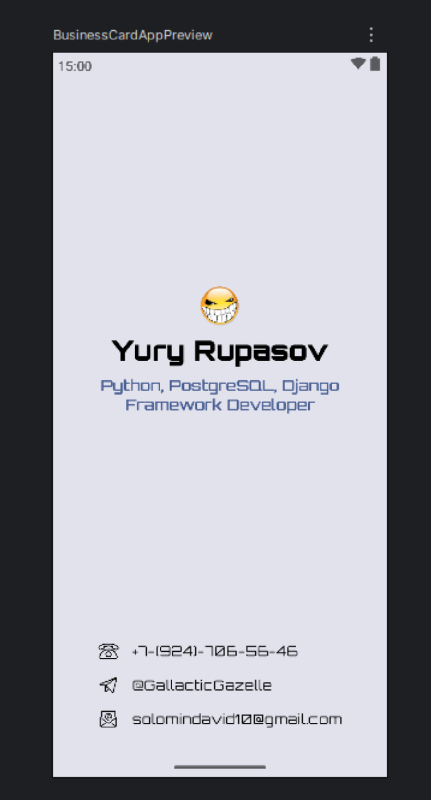

# Business Card App (Android)

Простое Android-приложение в виде цифровой визитной карточки, созданное для изучения основ Jetpack Compose.

## 📱 Скриншот

<!-- Здесь будет твой скриншот -->


## ℹ️ О проекте

Это учебный проект, демонстрирующий базовые принципы построения пользовательского интерфейса на Jetpack Compose. Приложение отображает личную информацию (аватар, имя, должность) и контактные данные с иконками.

## ✨ Основные возможности

*   Отображение персональной информации.
*   Список контактов (телефон, соцсеть, email) с соответствующими иконками.
*   Применение кастомного шрифта и цветовой схемы из Material Design 3.
*   Чистая архитектура UI с разделением компонентов на переиспользуемые функции.

## 🛠️ Стек технологий

*   **Язык:** [Kotlin](https://kotlinlang.org/)
*   **UI Toolkit:** [Jetpack Compose](https://developer.android.com/jetpack/compose)
*   **Архитектура:** UI Layer (без сложной архитектуры)
*   **Дизайн:** [Material Design 3](https://m3.material.io/)
*   **Среда разработки:** Android Studio

## 📂 Структура проекта

Код пользовательского интерфейса организован для переиспользования и читаемости.

app/
└── src/
└── main/
└── java/
└── com/example/businesscard/
├── MainActivity.kt # Главная Activity, собирает экран
└── ui/
├── theme/ # Файлы темы: Color.kt, Type.kt, Theme.kt
└── components/ # Переиспользуемые UI-компоненты
├── PersonalInfo.kt # Компонент для верхнего блока (имя, аватар)
└── ContactInfo.kt # Компонент для нижнего блока (контакты)


## 🚀 Как запустить

1.  Клонируйте репозиторий:
    ```sh
    git clone https://github.com/YOUR_USERNAME/YOUR_REPOSITORY.git
    ```
2.  Откройте проект в Android Studio Hedgehog или новее.
3.  Запустите сборку Gradle.
4.  Запустите приложение на эмуляторе или физическом устройстве.
