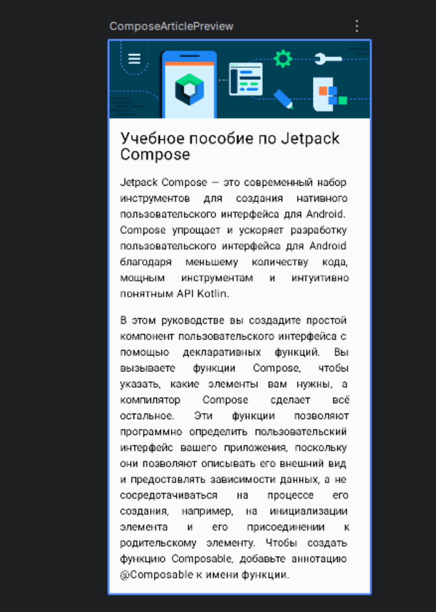

# KotlinCanvas: Jetpack Compose Article Screen

Это учебный Android-проект, демонстрирующий создание простого экрана-статьи с использованием Jetpack Compose. Проект показывает, как скомпоновать изображение и несколько текстовых блоков в единый прокручиваемый экран.

## 🖼️ Демонстрация

## 🚀 Основные возможности и изученные концепции

* **Вертикальная компоновка:** Использование `Column` для расположения элементов друг под другом.
* **Прокрутка контента:** Реализация вертикальной прокрутки с помощью модификатора `verticalScroll`.
* **Работа с изображениями:** Отображение изображения-шапки (`Image`) и его растягивание на всю ширину экрана.
* **Стилизация текста:** Настройка размера шрифта (`fontSize`), отступов (`padding`) и выравнивания текста (`TextAlign.Justify`).
* **Использование ресурсов:** Загрузка текстов и описаний из строковых ресурсов (`stringResource()`) для поддержки локализации и чистоты кода.

## 🛠️ Стек технологий

* [Kotlin](https://kotlinlang.org/)
* [Jetpack Compose](https://developer.android.com/jetpack/compose)
* Android Studio

## 🔧 Сборка и запуск

1. Клонируйте репозиторий: `git clone https://github.com/Dogafas/AndroidStudioProjectsEduc/tree/master/KotlinCanvas`
2. Откройте проект в Android Studio.
3. Соберите и запустите приложение на эмуляторе или физическом устройстве.

