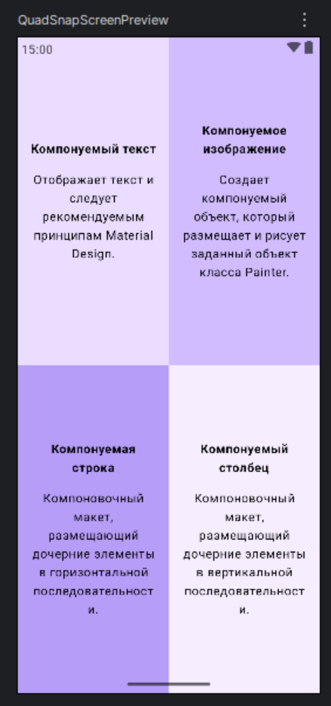

# QuadSnap 📱

QuadSnap is a simple Android application built with Jetpack Compose. This project is designed for beginners learning the fundamentals of UI layout in Kotlin. The app displays a 2x2 grid that divides the screen into four equal quadrants, with each quadrant containing a styled card with information about a specific Composable function.

<!-- RU: QuadSnap - это простое Android-приложение, созданное с помощью Jetpack Compose. Этот проект предназначен для начинающих, изучающих основы построения UI в Kotlin. Приложение отображает сетку 2x2, которая делит экран на четыре равных квадранта, каждый из которых содержит стилизованную карточку с информацией о конкретной Composable-функции. -->

## 📸 Screenshot

<!-- RU: Чтобы добавить скриншот:
1. Запусти приложение в эмуляторе или на устройстве.
2. Сделай скриншот (в эмуляторе это кнопка с фотоаппаратом на боковой панели).
3. Загрузи его на любой хостинг изображений (например, imgur.com).
4. Замени ссылку выше на свою. -->

## ✨ Features

* A screen divided into four equal quadrants.
* Each quadrant displays a title and a description in a styled card.
* Demonstrates vertical and horizontal centering of content within a container.
* Uses basic Jetpack Compose layouts like `Column` and `Row` with weights for proportional sizing.
* Applies padding and text styling (bold font weight).

<!-- RU:
## ✨ Особенности
* Экран, разделенный на четыре равных квадранта.
* Каждый квадрант отображает заголовок и описание на стилизованной карточке.
* Демонстрирует вертикальное и горизонтальное центрирование контента внутри контейнера.
* Использует базовые лэйауты Jetpack Compose, такие как `Column` и `Row` с весами для пропорционального размера.
* Применяет отступы и стилизацию текста (жирный шрифт).
-->

## 📚 Concepts Covered

This project is a practical exercise for understanding the following Jetpack Compose concepts:

* **Composable Functions:** Creating reusable UI components with the `@Composable` annotation.
* **Layouts:** Using `Column` for vertical arrangement and `Row` for horizontal arrangement.
* **Modifiers:** Applying attributes like size, padding, background color, and weight.
    * `Modifier.fillMaxSize()` to occupy all available space.
    * `Modifier.padding()` to add space around elements.
    * `Modifier.weight(1f)` to distribute space equally among siblings.
    * `Modifier.background()` to set a background color.
* **Text Styling:** Customizing the `Text` composable with `fontWeight` and `textAlign`.
* **Code Organization:** Refactoring UI components into separate files (`ComposableCard.kt`, `QuadSnapScreen.kt`) and organizing them into packages (`ui`) for better readability and maintenance.
* **Previews:** Using `@Preview` to visualize composables in Android Studio without running the app.

<!-- RU:
## 📚 Изученные концепции
Этот проект является практическим упражнением для понимания следующих концепций Jetpack Compose:
* **Composable-функции:** Создание переиспользуемых UI-компонентов с аннотацией `@Composable`.
* **Лэйауты:** Использование `Column` для вертикального и `Row` для горизонтального расположения.
* **Модификаторы:** Применение атрибутов, таких как размер, отступы, цвет фона и вес.
    * `Modifier.fillMaxSize()` для занятия всего доступного пространства.
    * `Modifier.padding()` для добавления отступов.
    * `Modifier.weight(1f)` для равного распределения пространства.
    * `Modifier.background()` для установки цвета фона.
* **Стилизация текста:** Настройка `Text` с помощью `fontWeight` и `textAlign`.
* **Организация кода:** Рефакторинг UI-компонентов в отдельные файлы и их организация в пакеты (`ui`) для лучшей читаемости.
* **Предпросмотр:** Использование `@Preview` для визуализации компонентов в Android Studio.
-->

## 📂 Project Structure

The project follows a simple structure to separate UI components from the main activity logic.

app/
└── src/
└── main/
└── java/
└── com/
└── example/
└── quadsnap/
├── MainActivity.kt # Main application entry point
└── ui/
├── ComposableCard.kt # UI for a single quadrant card
└── QuadSnapScreen.kt # The main 2x2 grid screen

## 🚀 Getting Started

To run this project:

1. Clone the repository: `git clone https://github.com/dogafas/quadsnap.git`
2. Open the project in Android Studio (latest stable version recommended).
3. Let Gradle sync the project dependencies.
4. Run the app on an emulator or a physical Android device.

<!-- RU:
## 🚀 Как запустить
1. Склонируйте репозиторий...
2. Откройте проект в Android Studio.
3. Дождитесь синхронизации Gradle.
4. Запустите приложение на эмуляторе или устройстве.
-->

## 🛠️ Tech Stack

* [Kotlin](https://kotlinlang.org/)
* [Jetpack Compose](https://developer.android.com/jetpack/compose)
* Android Studio
* Gradle

